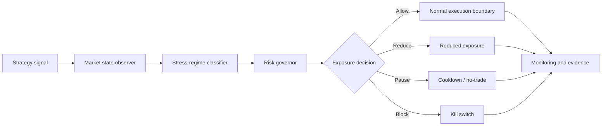

# XAU Stress Shield MT5

[](https://github.com/RicardoBarato/xau-stress-shield-mt5/actions/workflows/ci.yml)


Documentation-first research archive exploring stress-regime detection, survival controls and exposure containment for XAUUSD strategy workflows.

XAU Stress Shield MT5 studies a survival problem: a strategy can have a reasonable entry idea and still fail when volatility, drawdown clusters or execution stress change the risk environment. This archive separates entry logic from survival logic so the defensive layer can be studied on its own.

The public repository documents the architecture, research questions, evidence gap and validation plan. It does not publish operational trading source or verified quantitative performance metrics. Researchers can use it as a framework for future testing without treating the current archive as a performance claim.

> Public scope: documentation, methodology and reproducibility design.
>
> Evidence status: `data_or_evidence_insufficient`.
>
> No public trading source or validated performance claim.

## Project snapshot

| Area | Current state |
| --- | --- |
| Market | XAUUSD / Gold |
| Platform context | MetaTrader 5 |
| Public scope | Documentation, methodology and safeguards |
| Trading source | Not published |
| Verified metrics | Insufficient evidence |
| Operational approval | None |
| Research question | Can a stress shield improve strategy survival? |
| Public purpose | Preserve the framework for future continuation |

## The core idea

A good entry does not guarantee survival. Abnormal volatility can make normal risk assumptions unreliable, and drawdown clusters may require a separate control layer. A stress shield observes market state and can allow, reduce, pause or block exposure depending on conditions.

The shield must be causal, testable and auditable. It should not be used to hide a weak base strategy; it should show whether a separate survival layer improves risk behavior under defined stress regimes.

## Research questions

- Can stress regimes be detected without lookahead?
- How should legitimate volatility be separated from harmful stress?
- What false positives are acceptable?
- Which blocked trades were good and which were bad?
- How should cooldown windows be defined?
- How should normal risk and stress risk be compared?
- Does the result reproduce across brokers?
- What prevents overfitting?
- What makes a kill switch auditable?
- How should strategy risk and execution risk be separated?

## Conceptual architecture



This diagram is conceptual and non-operational.

## Evidence status

| Evidence component | Public status |
| --- | --- |
| Research hypothesis | Available |
| Architecture | Available |
| Risk-control concepts | Available |
| Public trading source | Not available |
| Reproducible market dataset | Not available |
| Verified backtest metrics | Insufficient |
| Operational approval | None |

`data_or_evidence_insufficient` means the public archive does not contain a verified evidence bundle with period, deposit, instrument, timeframe, profit factor, drawdown, trade count and source traceability. Metrics should not be invented or inferred.

## What has value today

The value today is architecture and method: stress taxonomy, separation of responsibilities, limitation tracking, validation design, publication hygiene, research questions and continuation path.

## Validation plan for future contributors

1. Define the baseline strategy.
2. Create a data contract.
3. Define stress labels.
4. Build causal features.
5. Define metrics.
6. Measure false positives.
7. Run ablation tests.
8. Test multiple years.
9. Test multiple brokers.
10. Run Monte Carlo analysis.
11. Publish positive and negative results together.
12. Keep operational approval separate.

## Included in this archive

- Documentation-first stress-shield research method.
- Evidence-gap explanation.
- Reproducibility notes.
- Limitation tracking.
- Publication guard and tests.
- Synthetic examples.

## Deliberately not included

- Public trading source.
- Verified performance metrics.
- Raw market data.
- Raw reports.
- Account, credential or broker materials.
- Operational approval.
- Unsupported performance claims.

## Repository map

```text
.
|-- src/
|   |-- mql5/
|   `-- python/
|-- tests/
|-- examples/
|   `-- synthetic_data/
|-- scripts/
|-- docs/
`-- .github/workflows/
```

- `src/mql5/` documents the public source posture; no operational XAU EA is published here.
- `src/python/` reserves space for public-safe Python research tooling.
- `tests/` contains guard tests using synthetic fixtures.
- `examples/synthetic_data/` contains non-market examples.
- `scripts/` contains the publication guard.
- `docs/` contains method, limitation, reproducibility and evidence-gap notes.
- `.github/workflows/` runs public candidate CI.

## Quick start

```bash
git clone https://github.com/RicardoBarato/xau-stress-shield-mt5.git
cd xau-stress-shield-mt5
python -m venv .venv
. .venv/Scripts/activate
python -m compileall scripts tests
python -m unittest discover -s tests
python scripts/publication_guard.py .
```

Useful review path:

1. Read [docs/RESEARCH_METHOD.md](docs/RESEARCH_METHOD.md).
2. Read [docs/EVIDENCE_GAP.md](docs/EVIDENCE_GAP.md).
3. Review [docs/CONCEPTUAL_ARCHITECTURE.md](docs/CONCEPTUAL_ARCHITECTURE.md).
4. Propose an experiment using [docs/CONTINUATION_GUIDE.md](docs/CONTINUATION_GUIDE.md).

This repository does not provide a public operational EA.

## Engineering and portfolio value

The project demonstrates research architecture, risk modeling, documentation-first design, public/private sanitization, secure release engineering, tests, CI, evidence governance, reproducibility planning and honest uncertainty communication.

## How to contribute

Useful contributions include clearer stress definitions, reproducibility improvements, validation protocols, limitation analysis, synthetic test cases, documentation corrections and future evidence packages that include both positive and negative outcomes.

## Supporting documents

- [Portfolio overview](docs/PORTFOLIO_OVERVIEW.md)
- [Research questions](docs/RESEARCH_QUESTIONS.md)
- [Conceptual architecture](docs/CONCEPTUAL_ARCHITECTURE.md)
- [Evidence gap](docs/EVIDENCE_GAP.md)
- [Continuation guide](docs/CONTINUATION_GUIDE.md)
- [Public archive release notes](docs/PUBLIC_ARCHIVE_RELEASE_NOTES.md)

## Disclaimer

This repository is educational research material only. It is not financial advice, trading advice, investment advice, a signal service, live performance evidence or a promise of returns. No system in this archive is approved for operational use.
