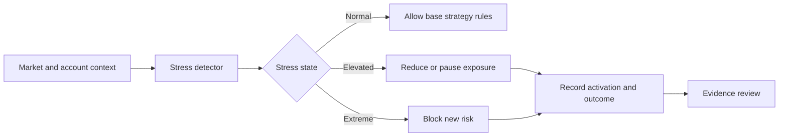

# XAU Stress Shield MT5

Documentation-first XAUUSD risk research archive for MetaTrader 5, focused on stress regimes, survival controls, limitations and reproducibility.

XAU Stress Shield MT5 studies a defensive layer around gold strategy workflows: how an automated system might reduce, pause or block exposure when volatility, drawdown or abnormal market conditions make survival more important than entry frequency.

Unlike EA USTEC Lab, this repository does not publish verified quantitative performance metrics. Its current value is architectural: it frames the risk problem, defines evidence standards, documents limitations and leaves a clean continuation path for future testing without inventing results.

> Research archive - open for study and continuation.
> Evidence status: `data_or_evidence_insufficient`. No candidate is approved for live, demo, signal or automated operational use.

## Project snapshot

| Area | Current state |
| --- | --- |
| Market | XAUUSD / gold |
| Platform | MetaTrader 5 |
| Primary focus | Stress regimes and survival controls |
| Repository posture | Documentation-first research archive |
| Published source posture | Public scaffold and review documentation |
| Quantitative evidence | Not sufficient for performance claims |
| Operational approval | None |
| Public purpose | Education, limitations and continuation |

## Why this project is interesting

Most trading research focuses on entries. This project focuses on the defensive layer that decides when a system should reduce risk, stop trading or wait for conditions to normalize. That makes the repository useful for developers thinking about survival controls, not only signal generation.

The archive is intentionally conservative: no backtest numbers are shown because no verified evidence bundle is present in the public package. Instead of filling that gap with weak claims, the project documents what would be required before any result could be presented responsibly.

## Core research idea

Separate entry logic from survival logic.

## Evidence status

| Question | Current answer |
| --- | --- |
| Are verified public backtest metrics included? | No |
| Are live, demo, paper or signal results included? | No |
| Is the repository claiming profitability? | No |
| Is the project useful as a methodology scaffold? | Yes |
| Can future evidence be added? | Yes, if period, instrument, timeframe, deposit, PF, drawdown, trade count and source traceability are documented |

See [docs/XAU_RESULTS.md](docs/XAU_RESULTS.md) and [docs/XAU_NEGATIVE_RESULTS.md](docs/XAU_NEGATIVE_RESULTS.md).

## Research components

| Component | Purpose |
| --- | --- |
| Stress regime definition | Describe abnormal conditions before deciding what the shield should do |
| Survival actions | Reduce, pause or block exposure instead of forcing entries |
| Limitation review | Track cases where defensive rules can overfit or remove useful participation |
| Reproducibility notes | Define what evidence must exist before metrics are published |
| Publication guard | Keep the public repository free of private artifacts and unsupported claims |

## Repository map

| Path | Purpose |
| --- | --- |
| [docs/RESEARCH_METHOD.md](docs/RESEARCH_METHOD.md) | Stress-control research method |
| [docs/XAU_RESULTS.md](docs/XAU_RESULTS.md) | Evidence status and no-metrics decision |
| [docs/XAU_NEGATIVE_RESULTS.md](docs/XAU_NEGATIVE_RESULTS.md) | Current negative-result posture |
| [docs/XAU_LIMITATIONS.md](docs/XAU_LIMITATIONS.md) | Known risks and limitations |
| [docs/XAU_REPRODUCIBILITY.md](docs/XAU_REPRODUCIBILITY.md) | Reproducibility expectations |
| [docs/PORTFOLIO_RESEARCH_OVERVIEW.md](docs/PORTFOLIO_RESEARCH_OVERVIEW.md) | Portfolio-style technical overview |
| [scripts/publication_guard.py](scripts/publication_guard.py) | Public repository guard |
| [tests](tests) | Guard tests using synthetic fixtures |

## What would make the project stronger

Future work should add evidence only when it can be audited. A responsible update would include:

1. A clearly defined historical period and instrument mapping.
2. Timeframe, spread, commission and execution assumptions.
3. Profit factor, drawdown, trade count and net result.
4. Positive and negative outcomes side by side.
5. A decision that separates research usefulness from operational approval.

## Public-use boundaries

- Educational research archive only.
- No financial advice, trading advice, signal service or managed-account claim.
- No candidate is approved for live, demo, paper, signal or automated operational use.
- No validated performance evidence is included in the current public package.
- Do not infer performance quality from architecture, diagrams or future research direction.
