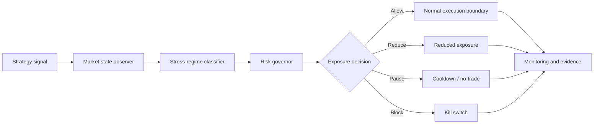

# Conceptual Architecture

This is a conceptual research architecture. It is not an operational EA and does not imply validated performance.

## Responsibilities

- The strategy signal proposes possible participation.
- The market state observer describes current conditions.
- The stress classifier assigns a causal state.
- The risk governor maps that state into exposure decisions.
- Monitoring records what happened so the shield can be audited later.
